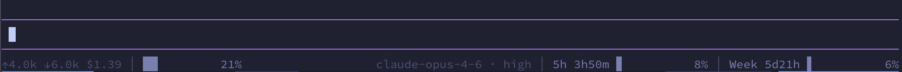

# pi-powerbar

A [pi](https://github.com/badlogic/pi) extension that renders a persistent powerline-style status bar with left-aligned and right-aligned segments.

Any other pi extension can update segments by emitting a single `powerbar:update` event — no imports or dependencies required.

## Install

```bash
pi install npm:@juanibiapina/pi-powerbar
```

## Usage

The powerbar renders a widget with two sides, like tmux:



### Producing segments

Any extension can update a segment:

```typescript
pi.events.emit("powerbar:update", {
  id: "git-branch",
  text: "main",
  icon: "⎇",
  color: "accent",
});
```

To remove a segment:

```typescript
pi.events.emit("powerbar:update", {
  id: "git-branch",
  text: undefined,
});
```

### Configuration

Settings are managed through [`pi-extension-settings`](https://github.com/juanibiapina/pi-extension-settings) and can be changed via the `/settings` command in pi.

| Setting | Description | Default |
|---------|-------------|---------|
| **Left segments** | Comma-separated segment IDs for the left side | `git-branch,tokens,context-usage` |
| **Right segments** | Comma-separated segment IDs for the right side | `provider,model,sub-hourly,sub-weekly` |
| **Separator** | String drawn between segments on the same side | ` │ ` |
| **Placement** | Where the powerbar appears (`belowEditor` or `aboveEditor`) | `belowEditor` |
| **Bar width** | Width of progress bars in characters (4–24) | `10` |

Segments not listed in either side are ignored.

## Development

```bash
npm install
npm run check    # lint + typecheck
npm run build    # compile to dist/
npm run dev      # watch mode
```

## License

MIT
